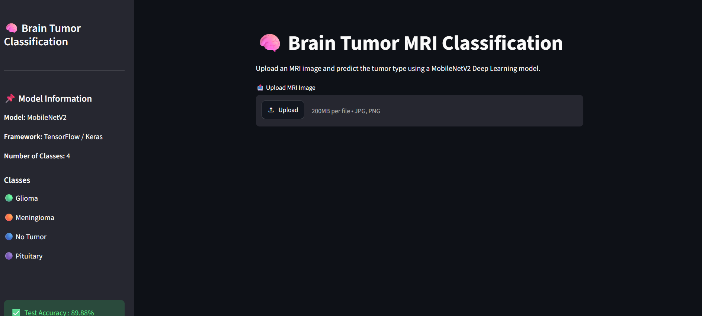
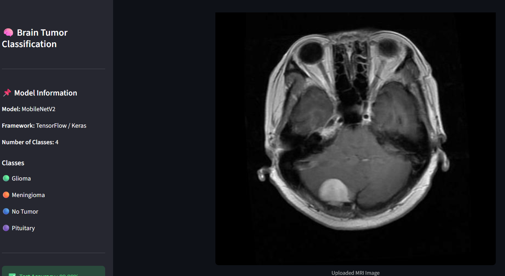
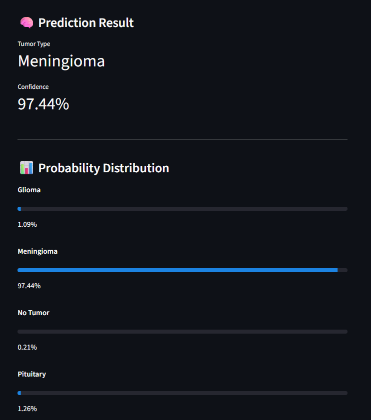
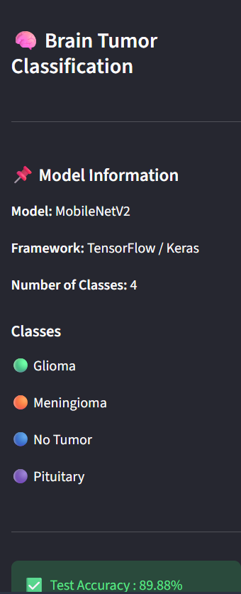
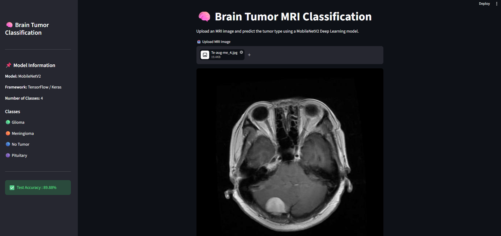
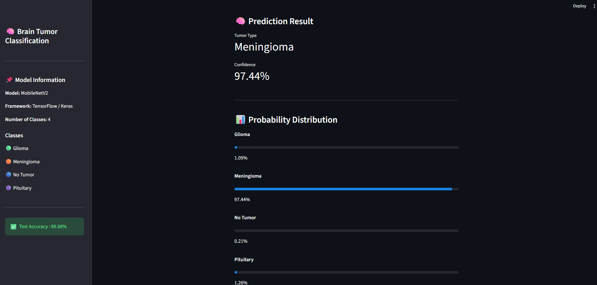

# 🧠 Brain Tumor MRI Classification using Deep Learning

A Deep Learning web application built using **TensorFlow, Keras, MobileNetV2, and Streamlit** that classifies brain MRI scans into four categories.

---

# 📌 Project Overview

This project predicts the type of brain tumor from MRI images using Transfer Learning.

The model can classify MRI images into:

- Glioma
- Meningioma
- No Tumor
- Pituitary Tumor

The application provides:

- MRI image upload
- Tumor prediction
- Confidence score
- Probability distribution for every class

---

# 🚀 Technologies Used

- Python
- TensorFlow
- Keras
- MobileNetV2
- NumPy
- Pillow
- Streamlit

---

# 🧠 Model

Transfer Learning Model

Base Model:

- MobileNetV2

Classifier:

- Global Average Pooling
- Dense Layer
- Dropout
- Softmax Layer

---

# 📊 Model Performance

| Metric | Value |
|---------|-------|
| Test Accuracy | **89.88%** |

---

# 📁 Dataset

Brain Tumor MRI Dataset

Classes:

- Glioma
- Meningioma
- No Tumor
- Pituitary

---

# 🖥️ Application Screenshots

## Home Page



---

## Upload MRI



---

## Prediction Result



---

## Sidebar



---

## Full Application

### Top Section



### Prediction Section



---

# ⚙️ Installation

Clone the repository

```bash
git clone <repository-url>
```

Go inside the project

```bash
cd Brain_Tumor_Classification
```

Create Virtual Environment

```bash
python -m venv venv
```

Activate

Windows

```bash
venv\Scripts\activate
```

Install dependencies

```bash
pip install -r requirements.txt
```

Run the application

```bash
streamlit run app/app.py
```

---

# 📌 Future Improvements

- Deploy on Streamlit Cloud
- Improve model accuracy
- Add Grad-CAM visualization
- Support DICOM MRI files
- Patient report generation

---

# 👨‍💻 Author

Vedam Sashank